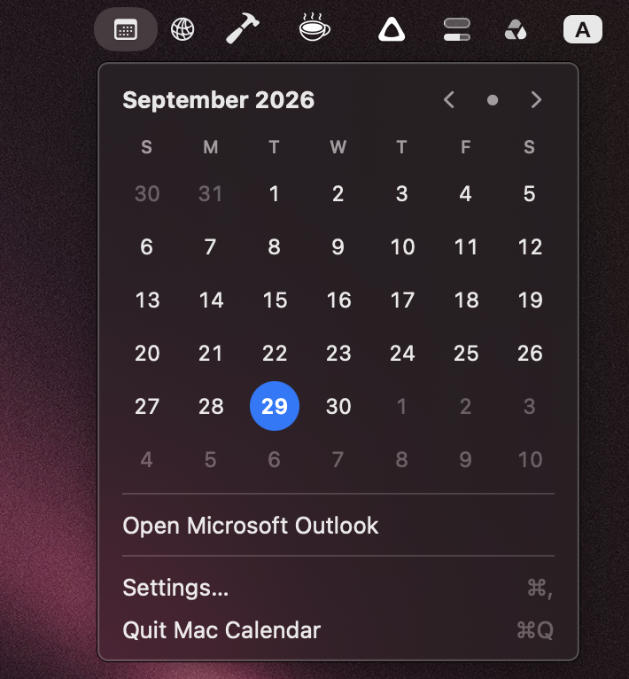
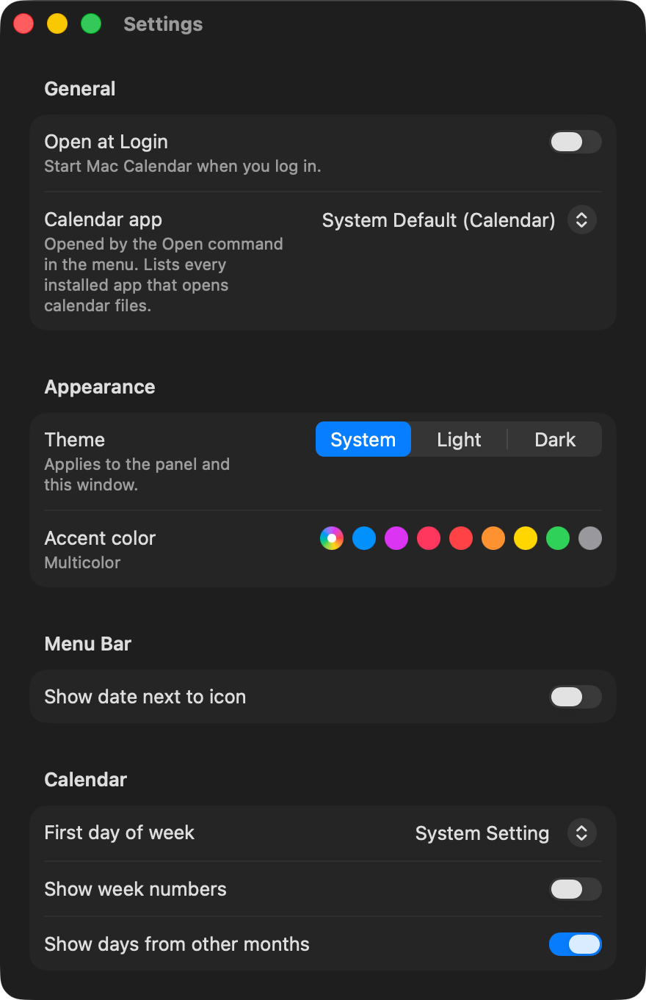

# Mac Calendar

A tiny native macOS menu bar calendar. Click the calendar icon in the menu bar for a
month view.




- Month grid with today highlighted; week start and day names follow your system settings.
- Your calendar events and reminders: dots under each day, a list for the selected day, and a
  week view (`W` or the list button). Check off reminders from the list.
- Add Event: type `Lunch with Dan Fri 1pm` and press Return.
- Optional Hebrew dates (in Hebrew letters) and Israeli holidays, computed offline.
- `⌥⌘P` opens the calendar from any app.
- `←` / `→` change month (or week), `T` jumps back to today (or use the header buttons).
- Updates itself at midnight, after sleep, and on time zone changes.
- Menu bar shows a calendar icon (optionally with the date).
- Open your calendar app, Settings… (⌘,), Quit (⌘Q).
- Settings: Open at Login, calendar app (detects every installed app that opens calendar files, e.g.
  Calendar, Outlook, Fantastical; default = system default), show date in menu bar, first day of week,
  week numbers, days from other months, events and which calendars, reminders, Hebrew dates,
  Israeli holidays, the ⌥⌘P shortcut, theme and accent color.

Calendars and Reminders access is asked for only when you turn those on in Settings. No network, no
dependencies. Swift 6 + SwiftUI, macOS 15+.

## Build

```bash
scripts/check.sh              # tests + release bundle
open build/MacCalendar.app
```

## License

MIT
